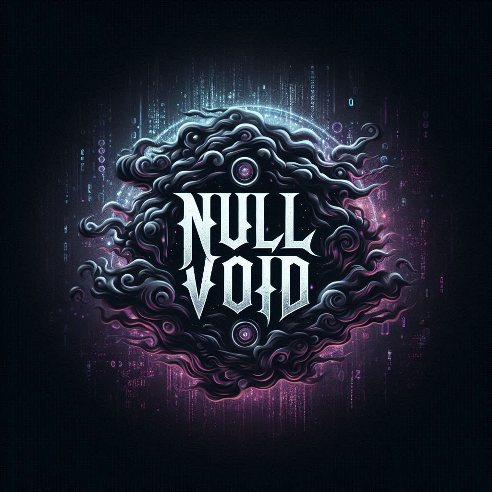

  

<h1 align="center">MAL3VANTCTRL | Red Team & Adversary Simulation</h1>

  <strong>Offensive Security • Adversary Simulation • Active Directory Exploitation</strong>

I focus on realistic, ethics-first offensive security: understanding how modern enterprise environments fail under pressure, then translating those lessons into better detection, hardening, and engineering decisions.

---

## About Me

I’m developing hands-on red teaming capability through **CRTP** and **PJPT** study while continuously testing and evolving a **homemade Active Directory lab** that I design, break, and rebuild. My work is grounded in repeatable methodology, clear documentation, and measurable outcomes (what changed, what improved, what’s still risky).

I care less about “running tools” and more about **reasoning**: threat modeling, tradeoffs, constraints, and how to operate safely and predictably in complex systems.

---

## Red Team Methodology (How I Work)

I approach engagements and labs using an operator’s loop: **Plan → Execute → Validate → Document → Improve**.

### 1) Scoping & Assumptions
- Define objective, constraints, and success criteria early
- Establish access model (internal/external), rules of engagement, and safe testing boundaries
- Identify likely defensive controls (EDR, logging, conditional access, segmentation)

### 2) Recon & Targeting
- Enumerate the environment to reduce guesswork
- Prioritize **high-value paths** (Tier 0 / identity infrastructure) and **low-friction** pivots
- Build hypotheses and validate them with minimal noise

### 3) Access & Privilege Growth
- Focus on **repeatable** routes, not one-off luck
- Prefer techniques that are observable and defensible (useful for blue team alignment)
- Treat privilege escalation as an evidence-driven process: “What permission, where, why?”

### 4) Lateral Movement & Objective Completion
- Move only when it increases capability or reduces risk of detection
- Validate access changes and assumptions at each step
- Maintain a clean chain of evidence: what worked, what failed, and what it implies

### 5) Reporting & Remediation Thinking
- Translate findings into business-impact language and remediation steps
- Include detection ideas: what logs/telemetry should have caught this?
- Recommend fixes that reduce entire classes of risk (not just patching one symptom)

---

## Tools I Use (Daily / In Labs)

I use tools as instrumentation—not as “magic buttons.” I aim to understand what each tool is doing under the hood.

### Active Directory & Identity
- **BloodHound**: relationship mapping, attack path discovery, privilege graph reasoning  
- **Impacket**: protocol-focused tooling (SMB/Kerberos/NTLM workflows) for controlled validation  
- **Rubeus**: Kerberos-focused inspection and controlled experimentation in lab scenarios  
- **LDAP tooling** (e.g., ldapsearch/ldap3): directory queries, attribute inspection, trust validation

### Enumeration & Testing Workflow
- **Python**: automation, parsing, repeatable lab experiments, and small “single-purpose” utilities  
- **PowerShell**: Windows-native inspection and operational glue  
- **Burp Suite** (when applicable): web attack surface testing and request-level reasoning  
- **Wireshark**: protocol validation and “trust but verify” for what’s actually happening on the wire

> I keep my work lab-contained and ethical: I focus on learning and validation, not indiscriminate exploitation.

---

## Certifications & Training (In Progress / Completed)

- **CRTP**: Active Directory attack paths, misconfiguration-driven escalation, and graph-based reasoning  
- **PJPT**: practical pentesting workflow, reporting discipline, and end-to-end assessment structure

---

## My Active Directory Lab (Homemade)

I built an AD environment specifically to practice realistic enterprise failure modes and verify understanding. I iterate it continuously by adding:

- Multiple hosts and roles (clients, servers, DCs)
- Misconfigurations and “gotchas” that mirror real orgs
- Logging/telemetry considerations so I can study detection opportunities
- Documentation of changes and outcomes to track progress over time

What I measure in the lab:
- Can I reproduce results reliably?
- Can I explain *why* the path exists (permissions, delegation, trust boundaries)?
- What detection signals should fire?
- What would I change to prevent recurrence?

---

## What I’m Working On Now

- Building **small Python tools** that automate common assessment tasks (enumeration, parsing, validation)
- Strengthening AD fundamentals: trusts, delegation models, ACL reasoning, and certificate-related concepts
- Developing cleaner reporting: clear risk statements, impact, reproduction narrative, and remediation priorities

---

## Portfolio (Selected Work)

Coming soon

---

## Contact

https://medium.com/@Mal3vAntCtrl
